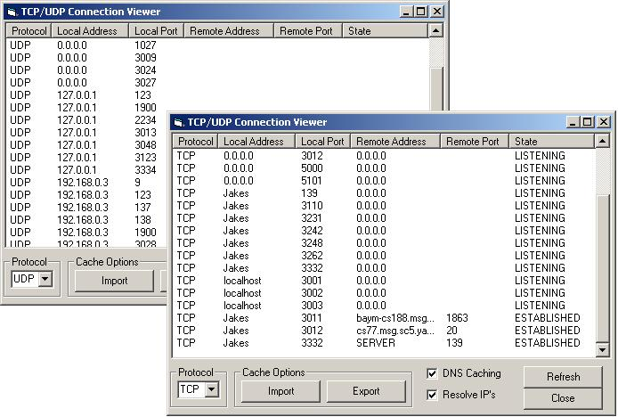



## TCP/UDP Connections Viewer

### Description

This program will show current connections for both TCP and UDP. Also Incorperated is a DNS class that will allow you to use a cache database to save time when resovling muliple IP's.

its allows you to Import and Export lists aswell. Please comment and vote
 
### More Info
 

             |
---                |---
**Submitted On**   |2003-09-18 09:57:02
**By**             |[�e7eN](https://github.com/Planet-Source-Code/PSCIndex/blob/master/ByAuthor/e7en.md)
**Level**          |Beginner
**User Rating**    |5.0 (15 globes from 3 users)
**Compatibility**  |VB 5\.0, VB 6\.0
**Category**       |[Miscellaneous](https://github.com/Planet-Source-Code/PSCIndex/blob/master/ByCategory/miscellaneous__1-1.md)
**World**          |[Visual Basic](https://github.com/Planet-Source-Code/PSCIndex/blob/master/ByWorld/visual-basic.md)
**Archive File**   |[TCP\_UDP\_Co1646929182003\.zip](https://github.com/Planet-Source-Code/e7en-tcp-udp-connections-viewer__1-48603/archive/master.zip)

